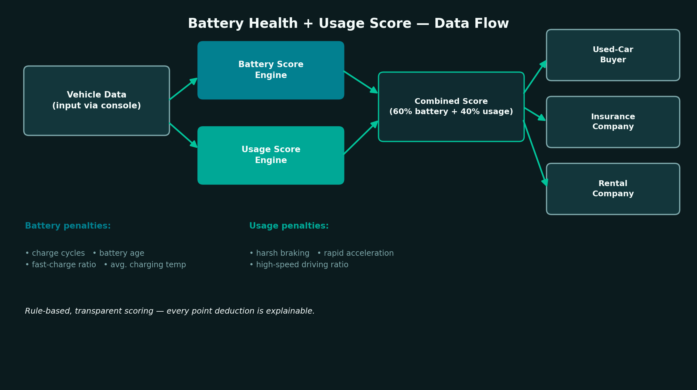
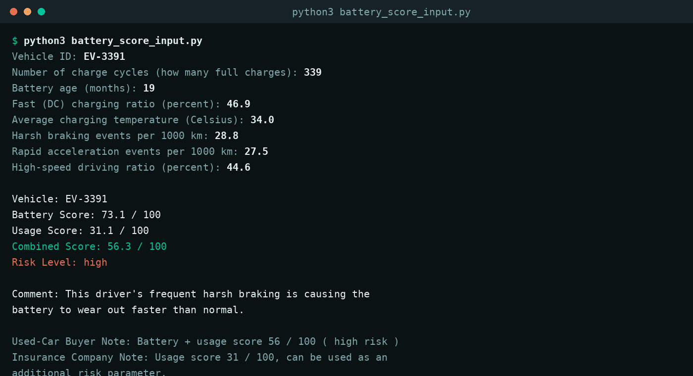

# 🔋 Battery Health + Usage Score

A rule-based, explainable scoring system that combines **EV battery data** with
**driving behavior data** into a single score — built as part of an automotive
engineering internship project exploring how anonymized EV data can create
value for multiple industries.

> *"This driver's aggressive and careless usage is causing the battery to
> wear out faster than normal."*

---

## 📌 Table of Contents

- [The Problem](#-the-problem)
- [The Idea](#-the-idea)
- [Research: How Real Companies Collect EV Data](#-research-how-real-companies-collect-ev-data)
- [Architecture](#-architecture)
- [Sample Output](#-sample-output)
- [Installation & Usage](#-installation--usage)
- [Scoring Methodology](#-scoring-methodology)
- [Project Structure](#-project-structure)
- [Roadmap](#-roadmap)
- [License](#-license)

---

## 🧩 The Problem

Electric vehicles constantly generate data — but today, almost none of it is
shared with the people who actually need it:

| Stakeholder | The blind spot |
|---|---|
| 🔄 **Used-car buyer** | Can't tell how much a battery has really degraded, even if mileage looks low |
| 🛡️ **Insurance company** | Calculates risk from crash history only — daily driving behavior is invisible |
| 🔑 **Rental company** | Can't objectively measure how a returned vehicle was actually driven |

All three are missing the same underlying signal: **how was this vehicle
actually used?**

## 💡 The Idea

Battery data alone tells you *how much* a battery has degraded. Driving
behavior data tells you *why*. Combined, they produce something more useful
than either alone:

```
Battery Data  +  Driving Behavior Data  =  Battery Health + Usage Score
(how worn out)    (why it got that way)      (0–100, explainable)
```

This single score can then be reshaped into a different report for each
stakeholder — a used-car buyer sees a transparency score, an insurer sees a
risk parameter, a rental company sees a usage/damage report.

## 🔬 Research: How Real EV Data Companies Work

Before writing any code, this project started with research into how existing
companies actually collect EV data — since "combine battery and driving data"
is meaningless without a real answer to *how do we get the data in the first
place?* Three real-world models were studied:

**1. Hardware-based (OBD-II port) — inspired by AVILOO**
A physical device plugs into the vehicle's OBD-II port and reads data
straight off the CAN bus / BMS. Doesn't require manufacturer partnership
(OBD-II is a universal standard), but only produces a point-in-time battery
health test — not continuous behavior data.

**2. Manufacturer API (cloud-based) — inspired by Recurrent**
No hardware at all. Data flows through the manufacturer's own cloud API
(typically via an aggregator like Smartcar, which unifies many OEM APIs
behind one interface), with the vehicle owner's consent. This produces
**continuous, live data** — which is essential for tracking driving behavior
over time, not just a single snapshot.

**3. Direct fleet partnership — inspired by BataryaZekası**
A direct data-sharing agreement between a platform and a manufacturer or
fleet operator, rather than individual vehicle owners.

**Why this project assumes the API model:** Since this system needs
*continuous* driving-behavior signals (harsh braking, rapid acceleration
patterns over time) — not a one-time test — the manufacturer-API model is
the only one of the three that architecturally fits. The hardware/OBD-II
route is excellent for a single battery health check, but can't capture
ongoing behavior.

> Note on the vehicle-infotainment-tablet route: this was also investigated
> and ruled out. In-car tablet operating systems (e.g. Android Automotive OS)
> restrict third-party app access to sensitive vehicle data behind
> OEM-approved allowlists, and non-system apps typically can't run while the
> vehicle is in motion — which is exactly when driving-behavior data is
> generated.

## 🏗️ Architecture



Since this project doesn't have access to a real manufacturer API (internship
MVP scope), the "Vehicle Data" box is currently filled by **manual console
input** — but the scoring engine itself is written independently of the data
source, so a real API integration could replace it without changing the
scoring logic at all.

## 🖥️ Sample Output



## 🚀 Installation & Usage

No dependencies beyond standard Python — this is intentionally a single,
plain script.

```bash
git clone https://github.com/uluccanturk/Ev-battery-u-a--score.git
cd Ev-battery-u-a--score
python3 battery_score_input.py
```

You'll be prompted for 8 values (charge cycles, battery age, fast-charging
ratio, average charging temperature, harsh braking events, rapid
acceleration events, and high-speed driving ratio). The program then prints
the battery score, usage score, combined score, a plain-language explanation
of the main contributing factor, and three sector-specific notes.

## 🧮 Scoring Methodology

Two sub-scores are combined into a weighted final score:

```
Combined Score = Battery Score × 0.6  +  Usage Score × 0.4
```

**Battery Score** (starts at 100, deductions for):
- High number of charge cycles
- Battery age
- Frequent fast (DC) charging
- Average charging temperature above 25°C

**Usage Score** (starts at 100, deductions for):
- Frequent harsh braking
- Frequent rapid acceleration
- High proportion of high-speed driving

The single largest contributing factor is surfaced in a plain-language
sentence (e.g. *"...frequent harsh braking is causing the battery to wear
out faster than normal"*), and a risk level (low / medium / high) is derived
from the combined score for use in the three sector-specific notes.

> ⚠️ **Important:** The coefficients above are **illustrative, not
> empirically calibrated**. They were chosen to produce sensible, explainable
> behavior for demonstration purposes — not derived from real degradation
> data. A production version of this system would need to calibrate these
> weights against real EV datasets (e.g. NREL, Kaggle EV driving/battery
> datasets) or real fleet data. This is intentional and documented here for
> transparency, not a hidden limitation.

## 📁 Project Structure

```
.
├── battery_score_input.py   # main script — reads input, computes and prints the score
├── images/
│   ├── architecture.png
│   └── sample_output.png
├── LICENSE
└── README.md
```

## 🗺️ Roadmap

- [ ] Replace manual input with a real (or simulated) manufacturer API feed
- [ ] Calibrate scoring coefficients against public EV datasets
- [ ] Add a simple web interface (Streamlit) for file upload (CSV/JSON) and fleet-level scoring
- [ ] Move from rule-based scoring to a trained model
- [ ] Formalize the three sector-specific report formats (PDF / API endpoint)

## 📄 License

MIT — see [LICENSE](LICENSE).

---

*Developed as part of an automotive engineering internship project on EV
data monetization opportunities.*
